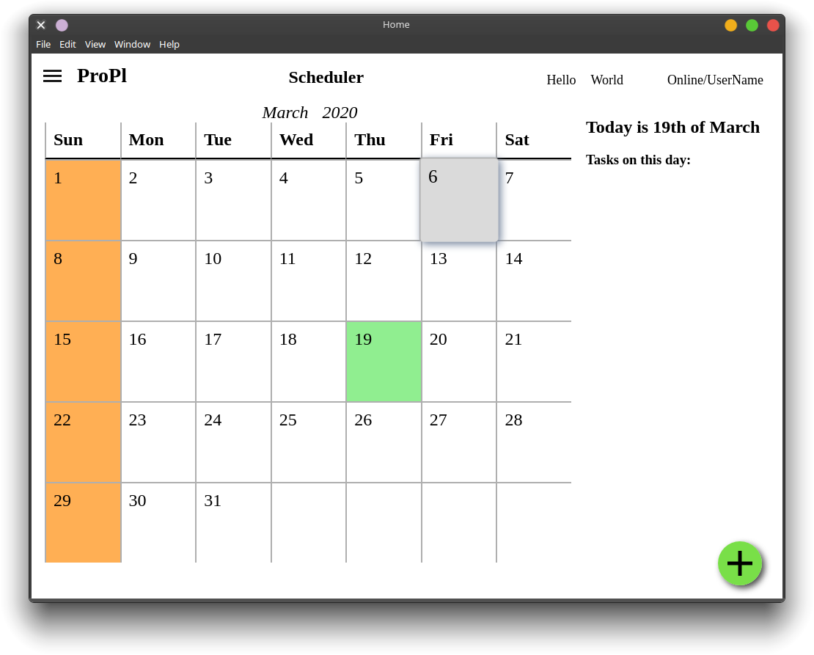
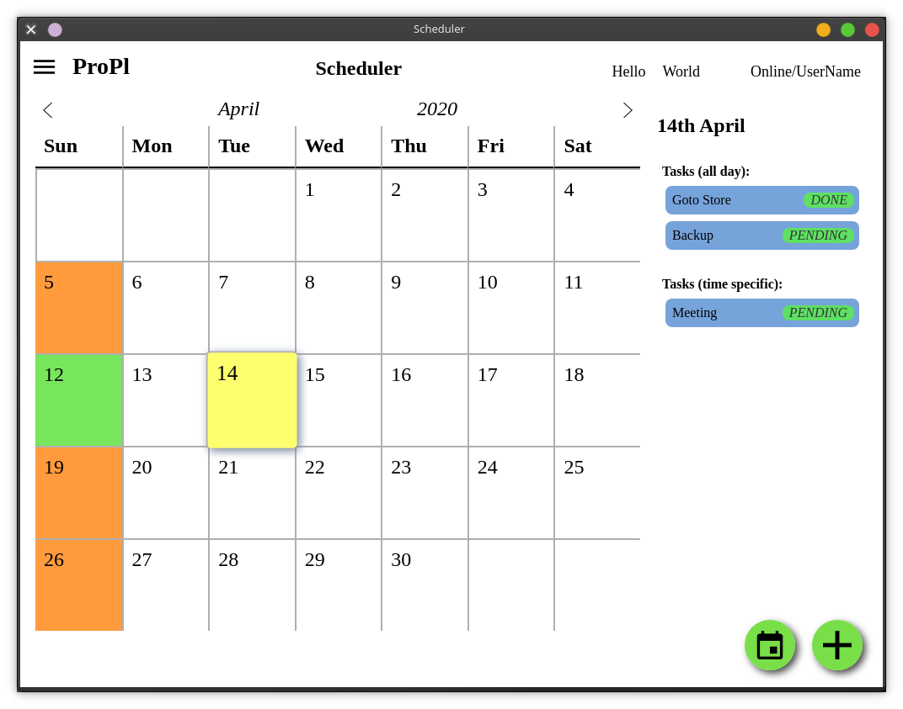

<!--
*** To avoid retyping too much info. Do a search and replace for the following:
*** RikilG, ProPl, twitter_handle, email
-->

<!-- PROJECT LOGO -->
<br />
<p align="center">
  <!-- <a href="https://github.com/RikilG/ProPl">
    
  </a> -->

  <h2 align="center">ProPl</h2>

  <p align="center">
    Productivity Planner
    <br />
    <a href="https://github.com/RikilG/ProPl"><strong>Explore the docs »</strong></a>
    <br />
    <br />
    <!-- <a href="https://github.com/RikilG/ProPl">View Demo</a>
    · -->
    <a href="https://github.com/RikilG/ProPl/issues">Report Bug</a>
    ·
    <a href="https://github.com/RikilG/ProPl/issues">Request Feature</a>
  </p>
</p>

<!-- <div align="center">
<a href="https://github.com/RikilG/ProPl">
  
</a>
</div> -->


## Table of Contents

- [Table of Contents](#table-of-contents)
- [About The Project](#about-the-project)
  - [Built With](#built-with)
- [Getting Started](#getting-started)
  - [Installation](#installation)
  - [Dependencies](#dependencies)
- [Usage](#usage)
- [Screenshots](#screenshots)
  - [Scheduler](#scheduler)
  - [Diary](#diary)
- [Ideas](#ideas)
- [Contributing](#contributing)
- [License](#license)


## About The Project

This application aims to be an all-in-one application all your todos, events, reminders, notes and diaries. Basically, it tries 
digitize all you paper needs. The main motive for me to build this project is that i usually scribble lot of stuff which 
i think are important and forget about them, and later when required, i'll have to hunt for it. I also felt the need for a 
better desktop application to mimic traditional andriod calendar.

After searching the internet to find the perfect application, i gave up as i couldn't find something in which i was 
satisfied. So, in the end, i have decided to put my skills to test, learn something worthwhile and build a perfect 
application hand-crafted to my needs.

This project is still in its early stages of development. Click [here](#screenshots) for project screenshots.


### Built With

* [Electron](https://www.electronjs.org/)
* [Nodejs](https://www.nodejs.org/)


## Getting Started

To get a local copy up and running follow these simple steps.


### Installation
 
1. Clone the repo
```sh
git clone https://github.com/RikilG/ProPl.git
cd ProPl
```
2. Install NPM packages
```sh
npm install
```
3. Run the development server
```sh
npm start
```


### Dependencies

This is a list of dependencies present/used in the project:
 - [Sqlite3](https://www.npmjs.com/package/sqlite3)
 - [Crypto](https://nodejs.org/api/crypto.html)

Complete set of dependencies can be found in package.json


## Usage

Examples on how to use this project will be put up here once there is considerable development. 
<!-- Additional screenshots, code examples and demos work well in this space. You may also link to more resources. You may also link to the wiki or documentation page. -->
<!-- For more examples, please refer to the [Documentation](https://example.com)_ -->


## Screenshots
### Scheduler

### Diary


## Ideas
Check (Requirements)[design/Requirements.md] for all current requirements to be satisfied by the end product
 - Scrape CMS to find notices/events and add to calendar
 - take photo of calendar and put as wallpaper
   - for neatness, blur existing wallpaper and overlay calendar on it(imagemagick?)
 - orgmode style notes (save in markdown, view in markdown)
 - add goals and checklist (like todo) for each day
 - use sql database to store events
 - include diary entries (encrypted?)
 - sync to google calendar


## Contributing

<!-- This can also be further explained in CONTRIBUTING.md -->
Contributions are what make the open source community such an amazing place to be learn, inspire, and create. Although this repo is still in early development phase, any contributions/improvements you would like make are **greatly appreciated**.

1. Fork the Project
2. Create a local clone       (`git clone https://github.com/{username}/ProPl`)
3. Create your Feature Branch (`git checkout -b feature/AmazingFeature`)
4. Commit your Changes        (`git commit -m "Add some AmazingFeature"`)
5. Push to the Branch         (`git push origin feature/AmazingFeature`)
6. Open a Pull Request

If you think there should be a new feature, please consider opening an issue [here](https://github.com/RikilG/ProPl/issues) or you can always fork this repo and implement it yourself!


## License

Distributed under the MIT License. See `LICENSE` for more information or [click here](LICENSE)